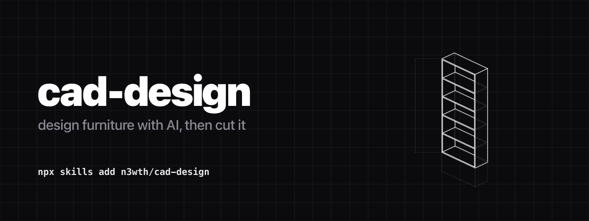

# cad-design



[](https://skills.sh/n3wth/cad-design)

```bash
npx skills add n3wth/cad-design
```

Design furniture with AI, then cut it. You give it "I want some shelves" and get back a plan: a drawing, a reusable prompt, examples, and a pre-saw checklist. One parametric model handles both the drawing and the CNC file, so they stay in sync.

Run it as an [agent skill](https://agentskills.io/specification) from Gemini CLI, Claude Code, or 18+ other agents. Or just use it by hand.

## What this is for

You have shop access (power tools, maybe a CNC) and a friend wants to build something but doesn't know where to start. Instead of handing them tools, give them a way to design it with AI. This produces a document (Notion page, markdown, whatever) they keep and reuse. Next build, just change a few inputs.

## Why it exists

AI agents already handle build prompts and cut lists pretty well on their own. They just consistently miss four things:

1. **An isometric drawing.** You can't picture a shelf from numbers alone. You need to see it.
2. **The back-and-forth.** Builds are conversations, not one-shot answers. "Make it 20 cm shorter," "I only have 15 mm ply," that kind of thing.
3. **A pre-cut gate.** AI dimensions are drafts, not toolpaths. Material and CNC time cost money.
4. **Something you keep and reuse.** Sits where you'll find it, designed to let you swap inputs and build again.

## Quickstart

Generate the isometric drawing and a CNC DXF from the parametric model:

```bash
# OCP is large; install takes minutes and may flake on slow pypi — retry
python3.12 -m venv venv && ./venv/bin/pip install build123d

# writes shelf-iso.svg + side-panel.dxf
./venv/bin/python assets/shelf.py .

rsvg-convert shelf-iso.svg -o shelf-iso.png   # then LOOK at it
```

Edit `W, H, D, T, N` at the top of `assets/shelf.py` for any box-carcass build.

> **Version pin matters:** use a Python **3.12** venv. On 3.14 the resolver pulled an OCP build missing `HashCode` and the model errored.

## Files

| File | Purpose |
|---|---|
| `SKILL.md` | The skill itself (frontmatter + instructions an agent follows). |
| `assets/shelf.py` | **Primary tool.** Parametric model → labeled isometric SVG + CNC DXF (build123d). |
| `assets/shelf-blueprint.py` | Renders a dimensioned blueprint iso: dashed hidden edges, line-weight hierarchy, and isometric dimension callouts. |
| `assets/make_cover.py` | Builds the cover banner and social card from the iso. |
| `assets/side-panel.dxf` | Example cut profile for **one** part (a side panel), exported from the same model. Not a full nested cutset — extend `shelf.py` to export every unique part. |

## Tooling, by job

| Job | Tool | Why |
|---|---|---|
| Iso drawing **+** cuttable geometry | **build123d** | One parametric model → render and DXF/STEP. Picture and toolpath stay in sync. |
| Interactive web drawing | [`@elchininet/isometric`](https://github.com/elchininet/isometric) | Clean lines in-browser. No auto-fit, no DXF. |
| "Vibe" render to show the look | Meshy / Tripo / ZSky | Looks great, **not measurable** — never cut from it. |
| Verify real CNC geometry | build123d / FreeCAD | Rebuild the final part in CAD; never cut from an LLM-authored DXF. |

---

## For agents

```yaml
skill: cad-design
kind: technique
invoke_when:
  - user wants to design a physical build with AI (shelves, desk, cabinet)
  - user has shop access (hand/power tools, CNC router, table saw)
  - the audience is a beginner or someone new to the specific gear
deliverable: a reusable document (Notion page or markdown) for the end user
# the four things agents skip by default — the skill's value. DO NOT omit.
the_four_things_to_ADD:
  - isometric_drawing     # via assets/shelf.py; render and LOOK first
  - collaborative_loop    # 3-4 follow-up prompts for iterative refinement
  - precut_gate           # checklist: parts vs stock, thickness, dry-fit
  - durable_artifact      # write where it's reused; "change only the blanks"
# agents already produce these well — include, no special effort
also_in_the_doc:
  - copy_paste_prompt     # with an explicit "tools I do NOT have" list
  - worked_example        # cut list, sheet yield, joinery, assembly
primary_tool:
  name: build123d
  language: python
  python: "3.12"          # 3.14 pulls an OCP missing HashCode
  install: "python3.12 -m venv venv && ./venv/bin/pip install build123d"
  run: "./venv/bin/python assets/shelf.py <out_dir>"
  outputs: [shelf-iso.svg, side-panel.dxf]
  render_check: "rsvg-convert shelf-iso.svg -o out.png"
fallbacks:
  interactive_web: "@elchininet/isometric"
  vibe_render: [meshy, tripo, zsky]     # not dimensionally accurate
hard_rules:
  - never cut from an AI-generated DXF without measuring it in CAD first
  - render every drawing and visually confirm before shipping
  - flat fills only; no shadows, gradients, or glows
```

Full instructions: see [`SKILL.md`](SKILL.md).

## Install

The [skills](https://skills.sh) CLI works with Gemini CLI, Claude Code, Cursor, Copilot, and 18+ agents:

```bash
npx skills add n3wth/cad-design
```

Or copy it in manually:

```bash
cp -r . ~/.gemini/skills/cad-design     # Gemini CLI
cp -r . ~/.claude/skills/cad-design     # Claude Code
```

## License

MIT
