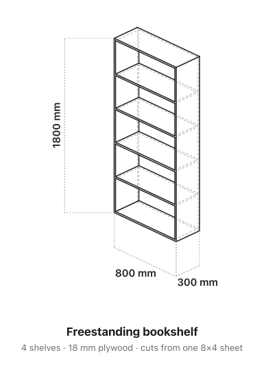

# cad-design — designing physical builds with AI

[](https://skills.sh/n3wth/cad-design)

```bash
npx skills add n3wth/cad-design
```

Turn a vague build idea ("I want some shelves") into a buildable artifact: a real isometric drawing, a reusable AI prompt, a worked example, and a verification gate before anything gets cut.

This is an [agent skill](https://agentskills.io/specification) — usable by an AI coding agent (Gemini CLI, Claude Code, etc.) and by a human reading it directly.



*Above: generated by `assets/shelf-blueprint.py` — a true hidden-line isometric from a 3D model, with isometrically-aligned dimension callouts. The CNC-ready DXF (`assets/shelf.py`) is extracted from a face of that same model, so the picture and the cut file stay in sync as the design changes.*

## What this is for

You have shop access (power tools, maybe a CNC) and a friend who wants to build something but doesn't know where to start. Showing them the tools isn't the next step — giving them a way to *design with AI* is. This skill produces a document (Notion page, markdown) they keep and reuse for every future build by changing a few inputs.

## Why it exists

Baseline testing showed AI agents already write decent build prompts and cut lists on their own. They reliably **skip** four things, which is all this skill adds:

1. **An isometric drawing.** Numbers don't let a beginner picture the object. A drawing does.
2. **The collaborative loop.** A build is a conversation ("make it 20 cm shorter", "I only have 15 mm ply") — not a one-shot answer.
3. **A pre-cut verification gate.** AI dimensions are a draft, never a toolpath. Sheet goods and CNC time cost money.
4. **A durable, reusable artifact.** Written where the user will find it again, designed to drive the next build by changing a few inputs.

## Quickstart (human)

Generate the isometric drawing + a CNC DXF from the parametric model:

```bash
python3.12 -m venv venv && ./venv/bin/pip install build123d   # OCP is large; minutes, may flake on slow pypi — retry
./venv/bin/python assets/shelf.py .                           # -> shelf-iso.svg + side-panel.dxf
rsvg-convert shelf-iso.svg -o shelf-iso.png                   # then LOOK at it
```

Edit `W, H, D, T, N` at the top of `assets/shelf.py` for any box-carcass build (shelves, cabinet, bench).

> **Version pin matters:** use a Python **3.12** venv. On 3.14 the resolver pulled an OCP build missing `HashCode` and the model errored.

## Files

| File | Purpose |
|---|---|
| `SKILL.md` | The skill itself (frontmatter + instructions an agent follows). |
| `assets/shelf.py` | **Primary tool.** Parametric model → labeled isometric SVG + CNC DXF (build123d). |
| `assets/shelf-blueprint.py` | Refined "blueprint" render: styles build123d's projection with dashed hidden edges (depth), line-weight hierarchy, and dimension callouts. Produces the hero image above. |
| `assets/shelf-iso.svg` / `.png` | Example output (the image above). |
| `assets/side-panel.dxf` | Example cut profile for **one** part (a side panel), exported from the same model. Not a full nested cutset — extend `shelf.py` to export every unique part. |

## Tooling, by job (chosen on evidence, not vibes)

| Job | Tool | Why |
|---|---|---|
| Iso drawing **+** cuttable geometry | **build123d** | One parametric model → render and DXF/STEP. Picture and toolpath stay in sync. |
| Interactive web drawing | [`@elchininet/isometric`](https://github.com/elchininet/isometric) | Clean lines in-browser. No auto-fit, no DXF. |
| "Vibe" render to show the look | Meshy / Tripo / ZSky | Looks great, **not measurable** — never cut from it. |
| Verify real CNC geometry | build123d / FreeCAD | Rebuild the final part in CAD; never cut from an LLM-authored DXF. |

---

## For agents (machine-readable)

```yaml
skill: cad-design
kind: technique
invoke_when:
  - user wants to design a physical build (shelves, desk, bench, planter, cabinet) with AI
  - user has shop access (hand/power tools, CNC router, table saw)
  - the audience is a beginner or someone new to the specific gear
deliverable: a reusable document (Notion page or markdown) for the end user
the_four_things_to_ADD:   # what agents skip by default — the skill's actual value. DO NOT omit.
  - isometric_drawing     # generate via assets/shelf.py (build123d); render and LOOK before shipping
  - collaborative_loop    # 3-4 follow-up prompts showing iterative refinement
  - precut_gate           # blocking checklist: re-add parts vs stock, thickness, dry-fit, CAD-verify DXF
  - durable_artifact      # write it where the user will find + reuse it (Notion/repo); note "change only the blanks"
also_in_the_doc:          # agents already produce these well — include, but no special effort
  - copy_paste_prompt     # parameterized, with an explicit "tools I do NOT have" list
  - worked_example        # cut list, sheet yield, joinery, assembly
primary_tool:
  name: build123d
  language: python
  python: "3.12"        # 3.14 pulls an OCP missing HashCode
  install: "python3.12 -m venv venv && ./venv/bin/pip install build123d"
  run: "./venv/bin/python assets/shelf.py <out_dir>"
  outputs: [shelf-iso.svg, side-panel.dxf]
  render_check: "rsvg-convert shelf-iso.svg -o out.png   # then view it"
fallbacks:
  interactive_web: "@elchininet/isometric"
  vibe_render: [meshy, tripo, zsky]     # not dimensionally accurate
hard_rules:
  - never cut from an AI-generated DXF without measuring it in CAD first
  - render every drawing and visually confirm before shipping
  - flat fills only; no shadows, gradients, or glows
```

Full instructions: see [`SKILL.md`](SKILL.md).

## Install

The [skills](https://skills.sh) CLI (top of this README) works with Gemini CLI, Claude Code, Cursor, Copilot, and 18+ agents. Or copy it in manually:

```bash
cp -r . ~/.gemini/skills/cad-design     # Gemini CLI
cp -r . ~/.claude/skills/cad-design     # Claude Code
```

## License

MIT
